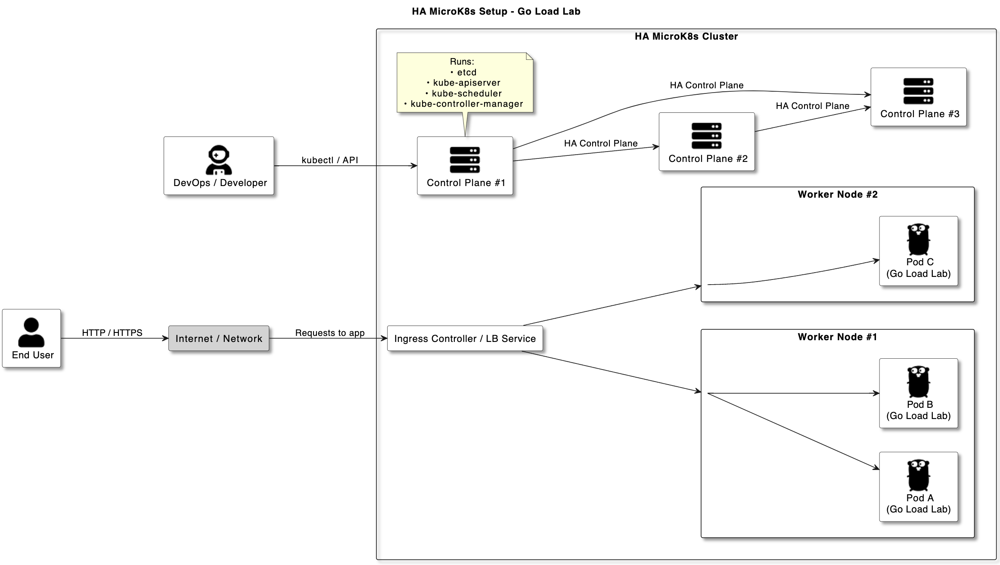
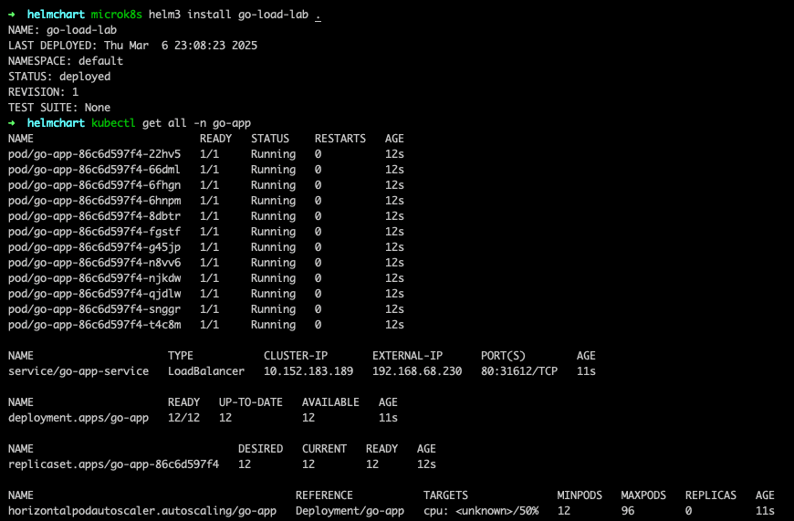
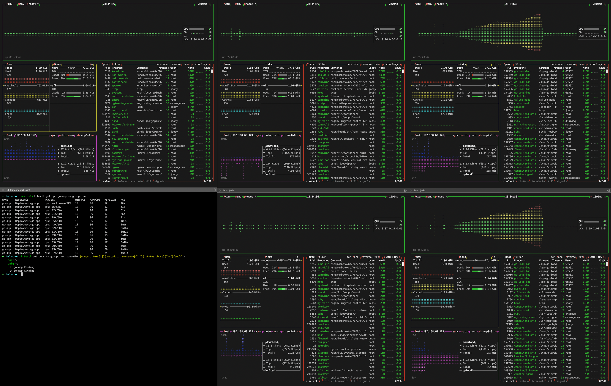

# HA MicroK8s Cluster – Overview

Below is a PlantUML diagram illustrating a highly available MicroK8s cluster with three control-plane nodes, multiple worker nodes, and an Ingress or LoadBalancer to handle external traffic. The Go Load Lab application runs on worker nodes, exposed via NodePorts / LoadBalancer / Ingress.



## HA Cluster Summary

- **Three Control-Plane Nodes**: Each runs `etcd`, `kube-apiserver`, `kube-scheduler`, and `kube-controller-manager`. MicroK8s handles leader election among these control-plane nodes for high availability.
- **Two (or More) Worker Nodes**: Host the **Go Load Lab** Pods. Each worker node can run multiple Pods.  
- **Ingress or LoadBalancer**:  
  - **Ingress Controller** (e.g., `nginx` or `haproxy`) or  
  - **MetalLB** (or another load-balancer solution)  
  to route external requests into the cluster.  
- **MicroK8s Add-Ons**:  
  1. **ingress** – Deploys the NGINX Ingress Controller.  
  2. **metrics-server** – Allows HorizontalPodAutoscaler (HPA) to collect CPU usage.  
  3. **metallb** – Provides a load-balanced IP address in a bare-metal environment.  
  4. **registry** (optional) – Local container image registry (`localhost:32000`).  

With this setup, your **Go Load Lab** application runs on the worker nodes, accessible externally via the assigned IP or DNS name. You can scale the application horizontally, rely on multiple control-plane nodes for redundancy, and experiment with load testing endpoints in a production-like environment.

## Install locally using Helm

Run following commands to install the chart:

```bash
microk8s enable helm3
microk8s helm3 install go-load-lab ./helmchart
```

The Result will look like this:


### Uninstall the application

```bash
microk8s helm3 delete go-load-lab
```


## Load Testing

> In [load-test](../load-test/ramp-test.js) we simulating real application behavior, by ramping up the number of requests from 10 to 200 VUs (Virtual Users) and making `/havy-call?cpu=10m&duration=0.1` that simulates heavy CPU usage - 10m CPU usage for 0.1 seconds.

We use [k6](https://k6.io/) to load test the application.

```bash
K6_WEB_DASHBOARD=true k6 run ramp-test.js
```

Result will look like this:


### Resource Saturation

I used pre-installed `btop` to monitor the resources on each VM.




## Deployment

### Using Node Selector to run the application on specific nodes

You can see that we using `nodeSelector` in [deployment.yaml](../helmchart/templates/deployment.yaml) to run the application only on `worker` nodes.

```yaml
nodeSelector:
  node.kubernetes.io/microk8s-worker: "microk8s-worker"
```

> **Note**: Main point here is to run the application on `worker` nodes, not on `control-plane` nodes.

### Using `livenessProbe` and `readinessProbe` to check the application status

In our simple application we are using `livenessProbe` to check the application status, to simulate real application behavior (e.g. cache hydration), so orchestrator will differentiates between `running` and `starting` pods.


## Using Horizontal Pod Autoscaler (HPA) to scale the application

We are using `hpa.yaml` with `maxReplicas` set to 96, even though we can't have more than 14 running pods on our 2 nodes (1 vCPU each).

It's done to show how HPA works and how it can scale the application.

HPA will keep in `pending` state if we don't have enough resources on the nodes. And if we will add new nodes to our cluster, HPA will start scaling the application.


Usfull snippet (used above) to check pods aggregated per state:

```bash
helmchart kubectl get pods -n go-app -o jsonpath='{range .items[*]}{.metadata.namespace}{" "}{.status.phase}{"\n"}{end}' \
  | sort \
  | uniq -c
```


